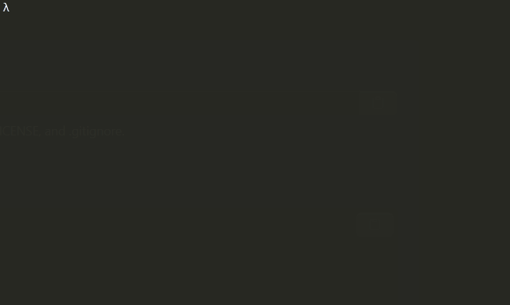

[](https://opensource.org/licenses/MIT)

## Spider Arena
> My second game in java
> Developed in **2014**, while studying **CS_101** while being an undergraduate in **Mathematics**.

-------
#### Example


-------
#### Setup
[](https://www.java.com/pt-BR/) [](https://maven.apache.org/)

Download the project from Github, compile using
``` java 
>>> javac MAP.java MONSTRO.java EXPLORER.java COMIDA.java GameScreenCli.java
```

To install dependencies, maven and java 1.8 are needed, then you can run: 

```sh
mvn clean install
```

-------
#### Running the game

To run the game just use the java command

``` java 
>>> java MAP
```

or, using Maven:

```sh
mvn clean compile package
java -jar target/explorer-1.0.jar
```
-------
